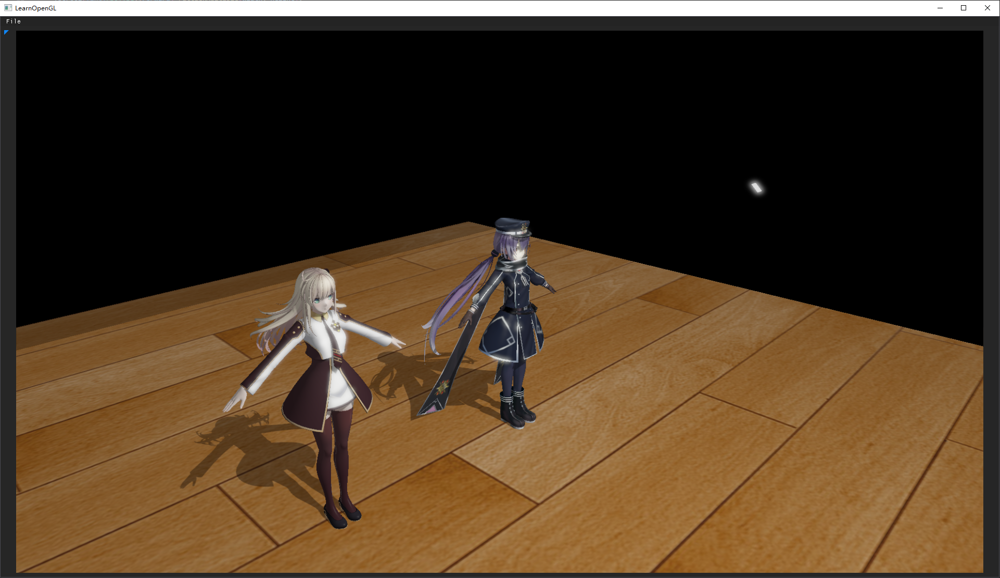

# yxgEngine

一款基于opengl与glfw的3D引擎

# 功能：
- 加载模型（现支持.obj, .pmx格式）
- 阴影映射（PCF,PCSS）与blinn-phong光照
- 可控渲染管线（支持前向渲染与延迟渲染）
- hdr与泛光效果
- 组合式管理实体与组件
- 简化的材质系统

# TODO:
- SSAO
- 使用imgui添加控制面板，并通过该界面管理场景（当前为硬编码）
- 实现序列化与反序列化来保存加载场景
- 渲染管线的切换
- PBR
- 将组件模式升级为ECS